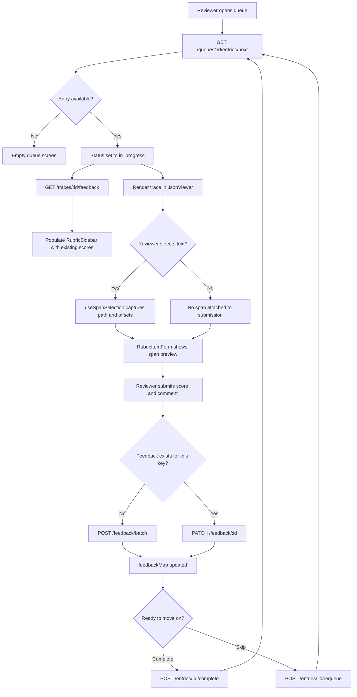
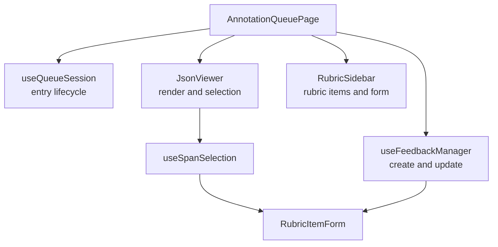

# Langsmith Annotation Queue - Lite

## Problem Overview

LLM applications generate large volumes of traces (input/output pairs), but teams need a structured way to evaluate their quality.

The annotation queue system provides: 
- a controlled FIFO workflow for human reviewers
- a rubric based structured evaluation
- concurrency safe distribution of work

## Constraints
- One reviewer per queue entry at a time. (:todo - write what is queue entry here)
- FIFO ordering must be preserved(i.e oldest queue entry time is evaluated first)
- Highlighting only supported within a single JSOn string node
- Feedback must be editable

## Architecture

The system is architectured around three decoupled domains to ensure maintainability.

- Entry Lifecycle (reservation and completion)
- Annotation (feedback and span management)
- JSON Viewer (rendering and selection)

## Data Model 
Two tables gain new columns. Everything elese in the schema remains same (untouched)

## Entry lifecycle

## Key Decisions

***Reservation*** -- `FOR UPDATE SKIP LOCKED` inside a transaction. Atomic, no external infrastructure, scales linearly with concurrent reviewers. The row-level lock releases in milliseconds. The TTL job handles the separate problem of sessions that crash while holding in_progress status.

***Loading existing feedback*** -- `GET /traces/{trace_id}/feedback` already existed and was fully implemented. Using it instead of building a duplicate endpoint.

***Feedback create vs update*** -- no unique constraint on `(trace_id, key)` by design. Frontend tracks feedbackMap keyed by feedback_key, uses `POST` on first submit and `PATCH` on subsequent ones for the same key.

***Span storage -- three colums***: `span_path JSONB` (e.g. `["outputs", "answer"]`), `span_start_index`, `span_end_index`. Matches what `window.getSelection()` provides and what `types.ts` already modeled.

Full decisions log with alternatives considered is in docs/decisions.md

## Frontend structure

##  Extra features 

***Keyboard shortcuts*** — Tab cycles rubric items, 1–9 sets score, Enter submits, N for next, S for skip. Shortcut legend via `?`.

***Track the trace number counter*** - track the traces in the queue. 

***show the status*** - 

***tag the reviwer with the org in the comment-***
 
***Optimistic feedback submission*** — score badge updates immediately on submit, reverts on error.

